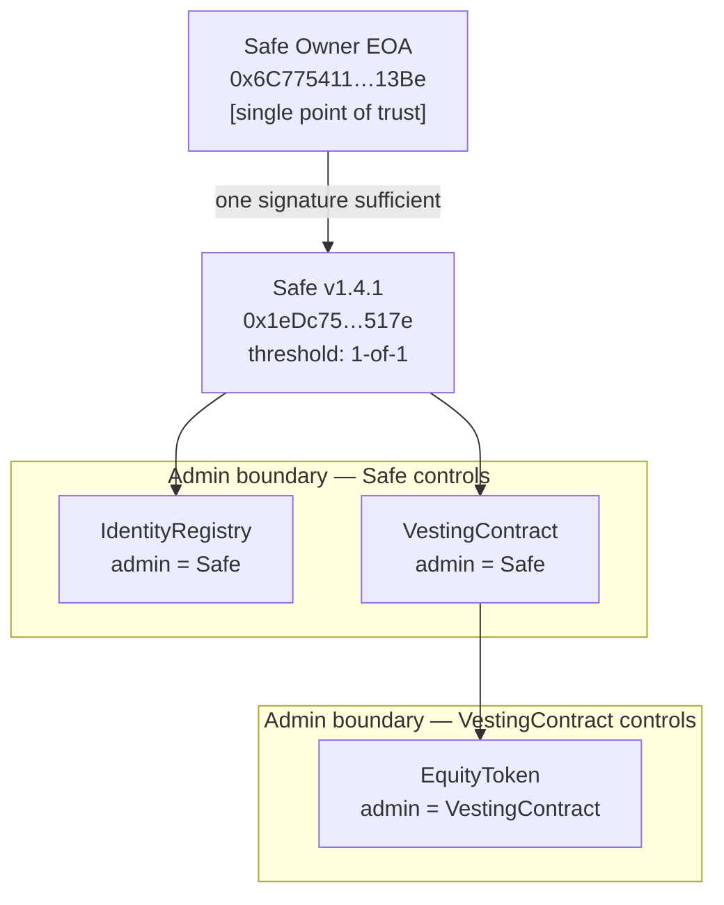
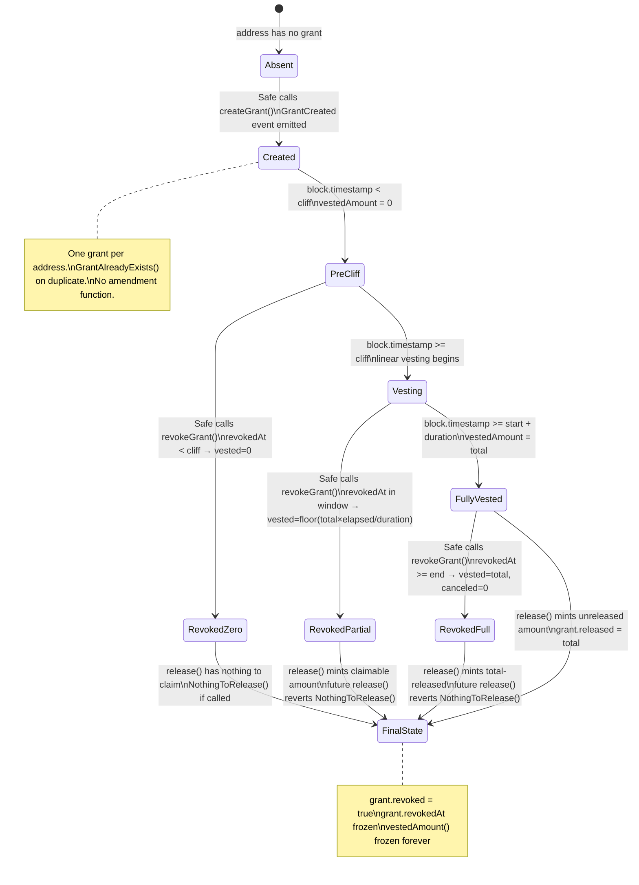
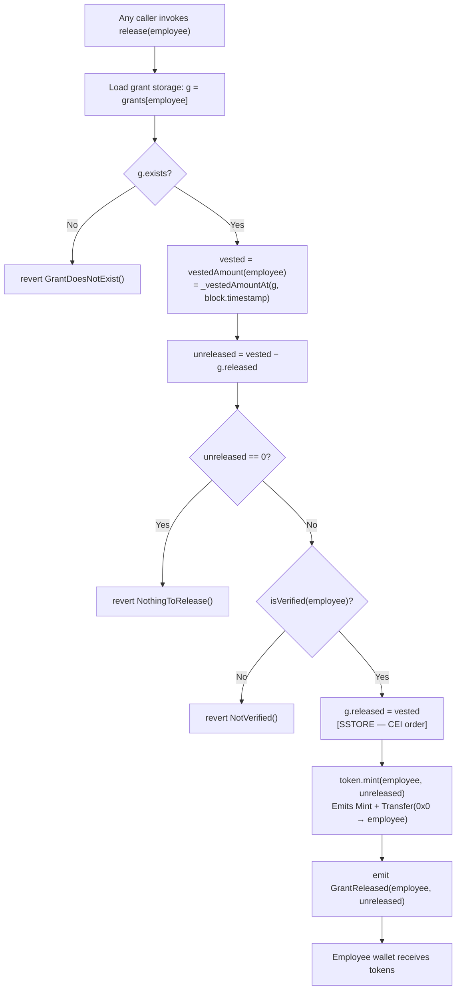
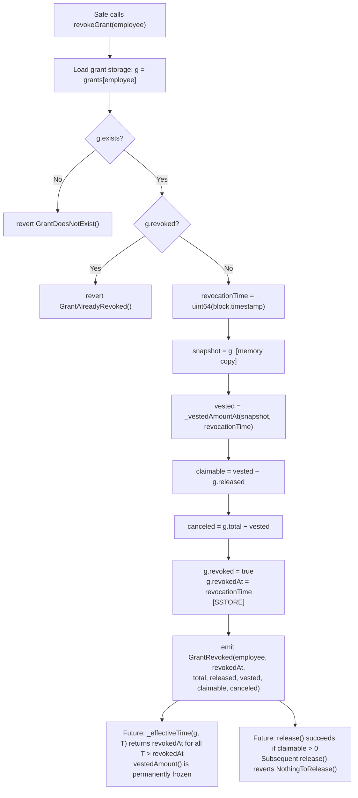
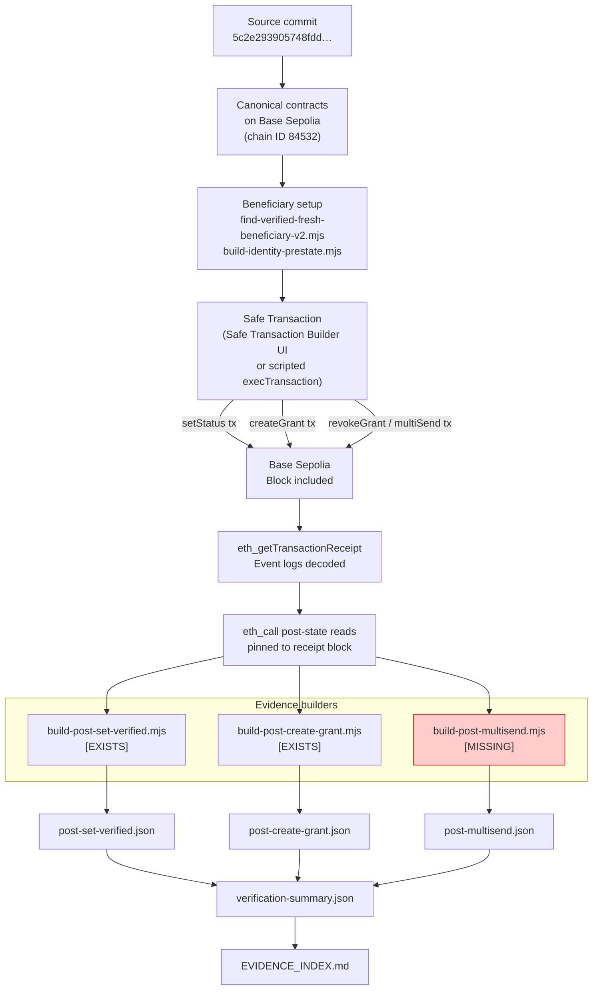
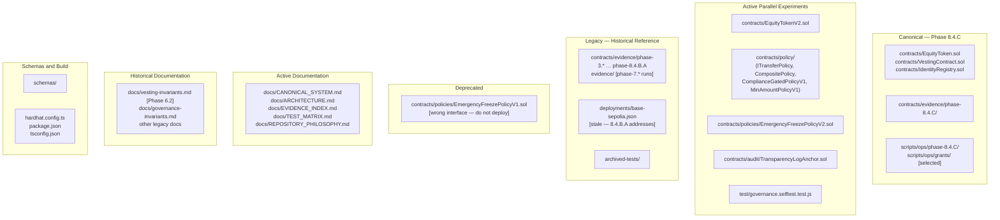

# Architecture — Phase 8.4.C

> For addresses, trust model, and component classification see [`CANONICAL_SYSTEM.md`](CANONICAL_SYSTEM.md).
> For evidence mapping see [`EVIDENCE_INDEX.md`](EVIDENCE_INDEX.md).

---

## 1. Canonical Contract Relationships

The diagram shows administrator relationships (dashed) and call relationships (solid) for Phase 8.4.C canonical contracts. The `EquityTokenV2` / `ITransferPolicy` / `CompositePolicy` stack is not shown here — see §7 for the repository organisation view.

```mermaid
graph TD
    OWNER["Safe Owner EOA\n0x6C775411…13Be"]
    SAFE["Safe v1.4.1\n0x1eDc75…517e\n(1-of-1 multisig)"]
    REG["IdentityRegistry\n0x9d6831…fEa4"]
    VEST["VestingContract\n0x4739e9…4f08"]
    TOKEN["EquityToken\n0x73b8e6…7c95"]
    BEN["Beneficiary Wallet"]

    OWNER -- "signs execTransaction" --> SAFE

    SAFE -. "admin" .-> REG
    SAFE -. "admin" .-> VEST
    VEST -. "admin (token.admin)" .-> TOKEN

    SAFE -- "setStatus(address, uint8)" --> REG
    SAFE -- "createGrant(employee,…)" --> VEST
    SAFE -- "revokeGrant(employee)" --> VEST

    VEST -- "isVerified(employee)" --> REG
    VEST -- "mint(employee, amount)" --> TOKEN

    TOKEN -- "isVerified(from/to)" --> REG

    BEN -- "release(employee) [permissionless]" --> VEST
    BEN -- "transfer(to, amount)" --> TOKEN

    TOKEN -- "Transfer(0x0 → employee)" --> BEN
```

**Key:**
- Dashed arrows (`-.->`) = administrator relationship (the source holds `admin` role over the target)
- Solid arrows (`-->`) = function call direction
- `release(employee)` has no caller restriction; any address may submit it

---

## 2. Governance and Trust Boundaries

All three canonical contracts are ultimately controlled by the Safe owner EOA. There is no second signer, time lock, or veto path.

---

## 3. Grant Lifecycle

---

## 4. Release Lifecycle

---

## 5. Revocation Lifecycle

**`_effectiveTime` boundary:** When `release` and `revokeGrant` execute in the same transaction (`queryTime == g.revokedAt`), the condition `queryTime > g.revokedAt` is `false`. The time cap does not apply and `release` computes the same vested amount as `revokeGrant`. This is Break Test B — proven in `contracts/evidence/phase-8.4.C/break-test-B-revoke-then-release/`.

---

## 6. Evidence Generation Flow

The diagram marks builder script availability. `[MISSING]` indicates no script exists in the current commit.

---

## 7. Repository Organisation

